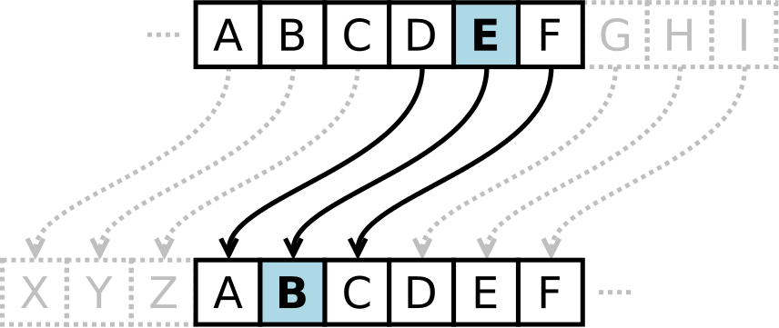

# JavaScript Challenge

For this JavaScript challenge we are going to implement one of the simplest and oldest encryption techniques.

## Caesar Shift

The [Caesar Shift](https://en.wikipedia.org/wiki/Caesar_cipher) also known as the Caesar cipher, or the shift cipher is a type of [substitution cipher](https://en.wikipedia.org/wiki/Substitution_cipher) where each letter on plaintext is replaced by a different letter a fixed number or positions down the alphabet.

Julius Caesar used this cipher in his private correspondence.  Caesar used a right shift of 3 to encode his messages.

For example, the letter A gets encoded to D.

To decode the message, you just reverse the shift.

Only letters get shifted, characters like whitespace, punctuation, etc are unchanged.

When shifting the alphabet will "roll over".

For example:

Z gets encoded to C.

This challenge will require you to shift both upper and lowercase letters.

For example:

Galvanize gets encoded to Jdoydqlch.

# Breaking the code

Like all single alphabet substitution ciphers the Caesar shift is easily broken and povides essentially no security.

These types of ciphers are normally easily broken with a [frequency analysis](https://en.wikipedia.org/wiki/Frequency_analysis)

